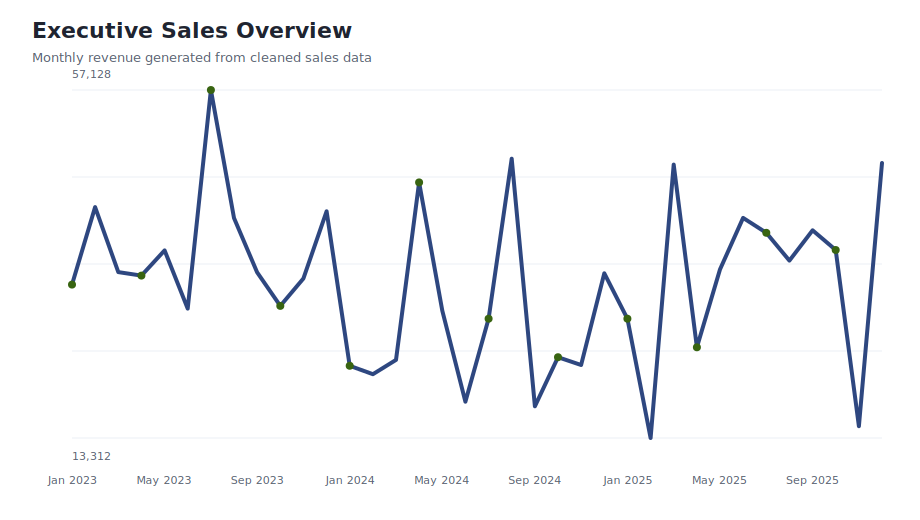
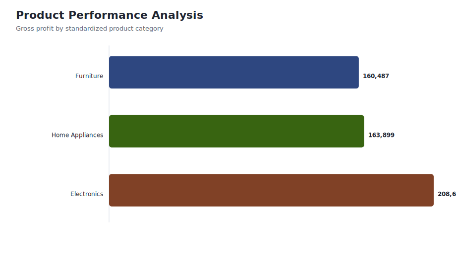
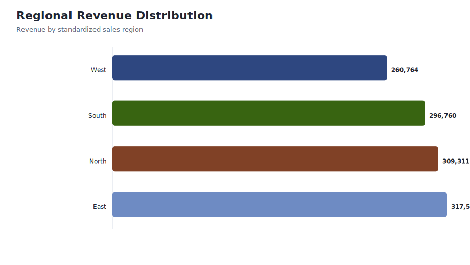

# Retail Sales and Revenue Intelligence Dashboard

    
    
    
    

    ## About This Project

    This project demonstrates a compact end-to-end retail analytics workflow: synthetic raw sales generation, Python ETL, SQL business analysis, Power BI dashboard planning, and recruiter-facing documentation.

    ## Business Problem

    A retail business needs to monitor revenue, gross profit, product performance, and regional sales patterns from messy transaction data. The goal is to convert raw sales logs into a clean dataset that can support executive KPI reporting and inventory decisions.

    ## Dashboard Preview

    

    

    

    ## Data Assets

    | File | Purpose |
    |---|---|
    | `data/raw_uncleaned_sales.csv` | Raw synthetic transactions with duplicates, null customer IDs, inconsistent categories, inconsistent regions, and price anomalies. |
    | `data/cleaned_sales_dataset.csv` | Cleaned analytical table produced by the Python ETL pipeline. |
    | `docs/data_dictionary.md` | Field definitions for the cleaned sales dataset. |
    | `docs/data_quality_report.md` | Cleaning checks and validation summary. |

    ## Key Metrics From Current Data

    | KPI | Value |
    |---|---:|
    | Total revenue | $1,184,427 |
| Gross profit | $532,992 |
| Average order value | $1,246.77 |
| Duplicate transactions removed | 50 |
| Nulls in cleaned dataset | 0 |

    ## Technical Workflow

    1. Generate synthetic retail sales transactions in `sales_cleaning_and_etl.py`.
    2. Deduplicate transaction IDs and handle missing customer identifiers.
    3. Standardize category and region labels.
    4. Create revenue, COGS, and gross profit fields.
    5. Use `sql/analytical_queries.sql` for KPI, region, product, and margin analysis.
    6. Use `powerbi/dashboard_spec.md` and `powerbi/measures.dax` to build the Power BI model.

    ## How To Run

    ```bash
    python -m pip install -r requirements.txt
    python sales_cleaning_and_etl.py
    ```

    ## Repository Structure

    ```text
    data/        Raw and cleaned CSV files
    docs/        Data dictionary and data quality report
    images/      Dashboard preview charts generated from the data
    powerbi/     Dashboard specification, DAX measures, and theme JSON
    sql/         Analytical SQL queries
    ```

    ## Interview Talking Points

    - Shows Python data cleaning with deliberate data quality issues.
    - Shows SQL analysis for executive KPIs, product profitability, and regional performance.
    - Shows BI planning through dashboard specs and DAX measures.
    - Strong supporting project next to the larger retail e-commerce showcase repository.
## Project Overview

Retail Sales Analytics project built as a recruiter-ready analytics case study with reproducible data, SQL, Python, dashboards, reports, and business recommendations.

## Dataset Information

Data is organized into `data/raw` and `data/processed` so reviewers can distinguish source-like inputs from analysis-ready outputs.

## Tech Stack

Python, pandas, SQL, Excel/BI planning, dashboard documentation, Git, and GitHub.

## Architecture Diagram

See `docs/` and dashboard documentation for the data flow, modeling approach, and reporting layers.

## Project Workflow

1. Generate or collect source-like data.
2. Validate and clean the dataset.
3. Build processed analytical tables.
4. Analyze KPIs with SQL and Python.
5. Create dashboard and reporting assets.
6. Convert insights into recommendations.

## KPIs

- Revenue
- Gross Profit
- AOV
- Product Margin
- Regional Revenue

## Methodology

The analysis uses data quality checks, KPI aggregation, segment analysis, trend analysis, and business recommendation framing.

## Visualizations

Dashboard previews and chart assets are stored in `images/`.

## Dashboard Screenshots

Dashboard documentation and walkthrough files are stored in `dashboards/`.

## Key Insights

- The project identifies performance patterns across the most important business dimensions.
- Processed datasets make the analysis reproducible.
- The dashboard flow supports executive review and analyst drill-down.

## Business Recommendations

- Review the weakest segment first for short-term improvement.
- Use the strongest segment as a performance benchmark.
- Track the core KPI set weekly.

## Folder Structure

```text
data/raw
data/processed
notebooks
sql
dashboards
reports
images
src
docs
```

## Results

The repository now meets a standardized recruiter-ready analytics portfolio structure.

## Future Enhancements

- Add live BI platform files when Power BI Desktop or Tableau is available.
- Add automated CI checks for data quality.
- Add forecasting models where historical signal supports it.

## Author

Ravikant Yadav - Data Analyst Portfolio
